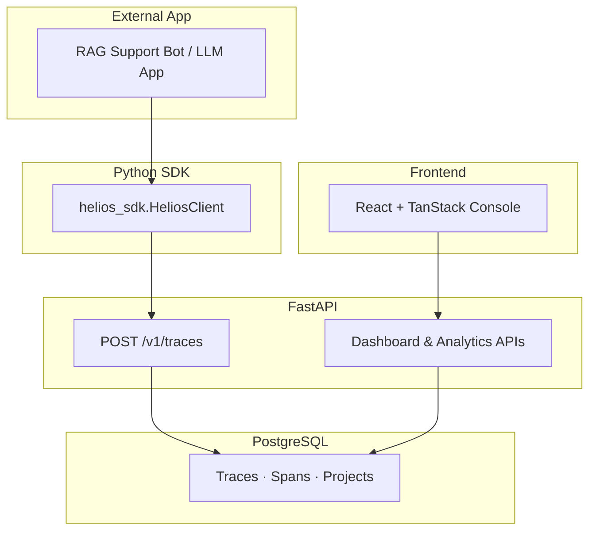

# Helios Component Diagram

```mermaid
flowchart TB
    subgraph External["External App"]
        App["RAG Support Bot / LLM App"]
    end

    subgraph SDK["Python SDK"]
        Client["helios_sdk.HeliosClient"]
    end

    subgraph Backend["FastAPI"]
        Ingest["POST /v1/traces"]
        Read["Dashboard & Analytics APIs"]
    end

    subgraph Data["PostgreSQL"]
        DB["Traces · Spans · Projects"]
    end

    subgraph UI["Frontend"]
        Console["React + TanStack Console"]
    end

    App --> Client
    Client --> Ingest
    Ingest --> DB
    Read --> DB
    Console --> Read
```
