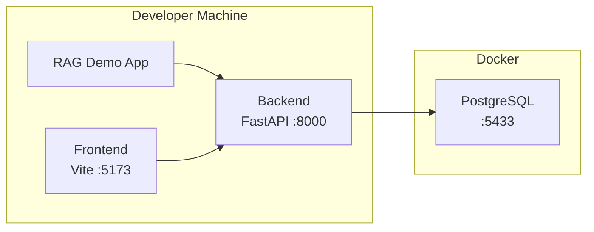

# Helios Local Deployment

```mermaid
flowchart LR
    subgraph Dev["Developer Machine"]
        FE["Frontend<br/>Vite :5173"]
        BE["Backend<br/>FastAPI :8000"]
        Demo["RAG Demo App"]
    end

    subgraph Infra["Docker"]
        PG["PostgreSQL<br/>:5433"]
    end

    Demo --> BE
    FE --> BE
    BE --> PG
```
