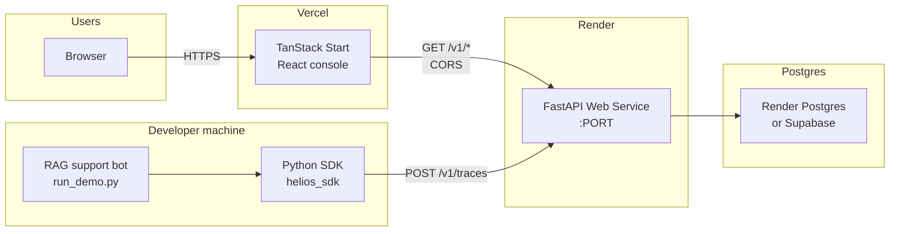

# Helios Production Deployment

Recommended public demo topology: Vercel frontend, Render backend, Render Postgres (Supabase as backup database option).

## Data flow

| Path            | Description                                                                                              |
| --------------- | -------------------------------------------------------------------------------------------------------- |
| **Read path**   | Browser loads SSR app from Vercel → client fetches dashboard/traces/RAG/evals from Render API → Postgres |
| **Ingest path** | External demo app builds span tree via SDK → `POST /v1/traces` → Postgres → visible in `/app/traces`     |
| **Seed path**   | One-time `POST /v1/demo/seed` (when `HELIOS_DEMO_MODE=true`) populates sample project `acme`             |

## Environment touchpoints

| Component  | Key variables                                               |
| ---------- | ----------------------------------------------------------- |
| Vercel     | `VITE_API_BASE_URL`, `VITE_HELIOS_DEMO_MODE` (build-time)   |
| Render API | `DATABASE_URL`, `CORS_ORIGINS`, `HELIOS_DEMO_MODE`, `$PORT` |
| Postgres   | Connection string in `DATABASE_URL` (SSL for Supabase)      |

See [docs/DEPLOYMENT.md](../docs/DEPLOYMENT.md) for setup steps.
