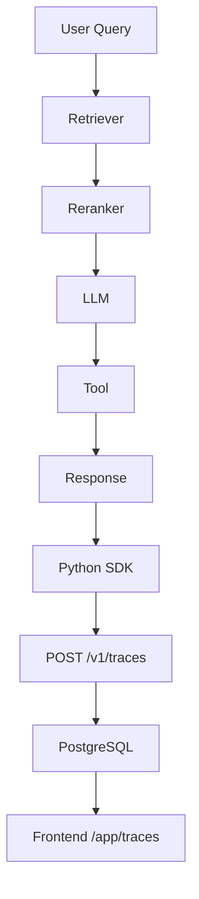

# Helios Trace Lifecycle

```mermaid
flowchart TB
    Query["User Query"]
    Retriever["Retriever"]
    Reranker["Reranker"]
    LLM["LLM"]
    Tool["Tool"]
    Response["Response"]
    SDK["Python SDK"]
    API["POST /v1/traces"]
    Database["PostgreSQL"]
    Frontend["Frontend /app/traces"]

    Query --> Retriever
    Retriever --> Reranker
    Reranker --> LLM
    LLM --> Tool
    Tool --> Response
    Response --> SDK
    SDK --> API
    API --> Database
    Database --> Frontend
```
