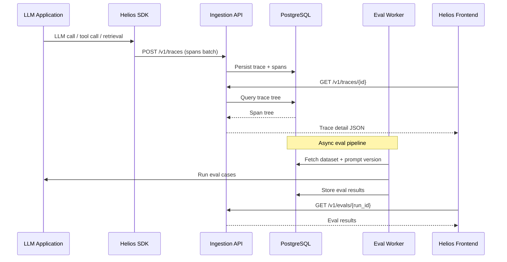

# Helios Architecture

## Current frontend architecture

Helios is a **frontend-first prototype** built with TanStack Start (SSR-capable React framework on Vite).

```
src/
├── start.ts              # TanStack Start instance + error middleware
├── server.ts             # SSR server entry
├── router.tsx            # Router configuration
├── routeTree.gen.ts      # Generated route tree
├── styles.css            # Global styles + Tailwind
├── routes/
│   ├── index.tsx         # Marketing landing page
│   ├── app.tsx           # App layout route
│   └── app.*.tsx         # Dashboard pages (demo data)
├── components/
│   ├── helios/           # Product-specific components
│   └── ui/               # Shared shadcn/ui primitives
├── lib/                  # Utilities, error handling
└── hooks/                # React hooks
```

### Routing

- `/` — Editorial marketing landing page
- `/app/*` — Observability console (dashboard, traces, prompts, evaluations, RAG analytics, experiments, datasets, settings)

All app pages currently render **static demo data** from `src/components/helios/demo-data.ts`.

### Data layer (current)

No API client or state management for backend data exists yet. TanStack Query is installed but not wired to live endpoints.

---

## Planned backend architecture

```
┌─────────────────────────────────────────────────────────┐
│                     Client Applications                  │
│  (Python/TS SDK, OpenTelemetry exporters, HTTP API)     │
└──────────────────────────┬──────────────────────────────┘
                           │ POST /v1/traces, /v1/spans
                           ▼
┌─────────────────────────────────────────────────────────┐
│                   Ingestion API (FastAPI)                │
│  Auth · Validation · Rate limiting · Project scoping    │
└──────────────┬──────────────────────────┬───────────────┘
               │                          │
               ▼                          ▼
        ┌─────────────┐           ┌─────────────┐
        │ PostgreSQL  │           │    Redis    │
        │  (primary)  │           │  (queues)   │
        └──────┬──────┘           └──────┬──────┘
               │                          │
               ▼                          ▼
        ┌─────────────┐           ┌─────────────┐
        │  Query API  │           │   Workers   │
        │  (FastAPI)  │           │ Celery/RQ   │
        └─────────────┘           └─────────────┘
```

### Backend modules (planned)

| Module | Responsibility |
|--------|----------------|
| `traces` | Trace CRUD, search, filtering |
| `spans` | Span storage, tree reconstruction |
| `prompts` | Prompt versioning, diff |
| `evals` | Eval suite execution and scoring |
| `datasets` | Eval dataset management |
| `rag_analytics` | Retrieval metrics aggregation |
| `experiments` | A/B comparisons |
| `projects` | Multi-tenant project scoping |
| `sdk_ingestion` | SDK and OTel ingestion endpoints |

---

## Planned data flow



---

## Planned tracing model

OpenTelemetry-inspired hierarchy:

```
Trace
├── Span (root: agent.run)
│   ├── Span (llm.chat)
│   ├── Span (tool.search)
│   │   └── Span (retriever.query)
│   └── Span (llm.chat)
```

Each span carries:

- `trace_id`, `span_id`, `parent_span_id`
- `name`, `kind` (llm | tool | retriever | agent | custom)
- `start_time`, `end_time`, `duration_ms`
- `status` (ok | error)
- `attributes` (model, tokens, cost, etc.)
- `events` (optional)

---

## Planned evaluation pipeline

1. User defines eval suite with dataset + prompt version + evaluators
2. API enqueues eval run to Redis
3. Worker executes each case: call model → score output
4. Results stored with per-case scores and aggregate metrics
5. Frontend displays comparison tables and trends

Evaluator types:

- **Deterministic** — exact match, regex, JSON schema
- **LLM-as-judge** — rubric-based scoring
- **Code-based** — custom Python/JS evaluator functions

---

## Planned RAG analytics pipeline

Metrics computed from retrieval spans in production traces:

- **Hit rate** — queries with ≥1 relevant chunk retrieved
- **Citation coverage** — answers with source attribution
- **Missing source rate** — answers without supporting retrieval
- **Latency breakdown** — embed → retrieve → rerank → generate

Aggregated by time window, project, and knowledge base.
